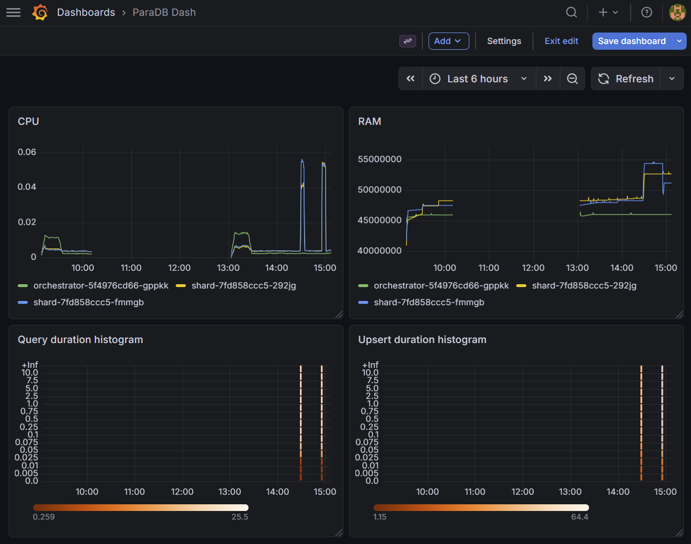
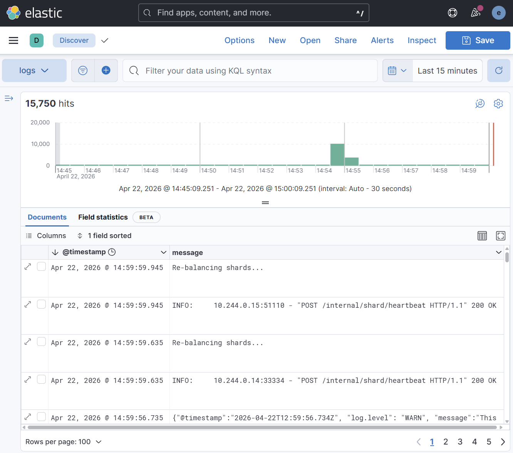

# ParaDB: a simple, parallel document db with separate storage and compute

This is a slow DB for education purposes only. Mostly for mine, I wrote it to learn how parallel DBs work.

## Architecture

This runs in Kubernetes (Docker Desktop). The DB is written in Python (FastAPI + Uvicorn), has a single **orchestrator** and a number of
dynamic **shards**. Storage is separate from compute (shared disk volume), and scale-to-zero would be possible to
implement fairly easily, but the orchestrator would still need to be running. The shards scale horizontally in a linear
fashion.

Each shard is responsible for a number of partitions (1024 total, derived from the low 10 bits of the document UUID).
A shard that receives a write for a document belonging to a partition it does not own will forward the write to the
owning shard.

```
                         ┌──────────────┐
                         │ Orchestrator │ :3356
                         │  (balancer)  │
                         └──┬───┬───┬───┘
                ┌───────────┘   │   └───────────┐
                ▼               ▼               ▼
          ┌──────────┐   ┌──────────┐   ┌──────────┐
          │ Shard 0  │   │ Shard 1  │   │ Shard 2  │  :3357
          │ P0..P341 │◄─►│P342..P682│◄─►│P683..1023│
          └────┬─────┘   └────┬─────┘   └────┬─────┘
               │              │              │
               └──────────────┼──────────────┘
                              ▼
                     ┌────────────────┐
                     │  Shared Volume │
                     │  /data/{hex}/  │
                     │   *.json docs  │
                     └────────────────┘
```

### Key endpoints

| Component   | Endpoint                               | Description                          |
|-------------|----------------------------------------|--------------------------------------|
| Shard       | `POST /db/document`                    | Create/upsert a document             |
| Shard       | `DELETE /db/document/{doc_id}`         | Delete a document                    |
| Shard       | `POST /db/query`                       | MongoDB-like query (`$gt`, `$lt`, `$exists`) |
| Orchestrator| `POST /internal/shard/heartbeat`       | Register/heartbeat a shard           |
| Orchestrator| `DELETE /internal/shard?hostname=...`  | Gracefully remove a shard            |

### Environment variables

| Variable             | Default                     | Description                          |
|----------------------|-----------------------------|--------------------------------------|
| `DATA_DIR`           | `./data/`                   | Root directory for document storage  |
| `SHARD_SERVICE_PORT` | `3357`                      | HTTP port for shard                  |
| `ORCHESTRATOR_URL`   | `http://orchestrator:3356`  | Orchestrator url (default `http://orchestrator:3356`) |

## Prerequisites

- [Docker Desktop](https://www.docker.com/products/docker-desktop/) with Kubernetes enabled
- Python 3.11+
- `kubectl`

## Running locally (without Kubernetes)

```bash
pip install fastapi uvicorn httpx pydantic

# Terminal 1 — start the orchestrator
python -m orchestrator

# Terminal 2 — start a shard
DATA_DIR=./data ORCHESTRATOR_URL=http://localhost:3356 python -m shard
```

## Start ParaDB in Kubernetes (Docker Desktop)

```bash
scripts/k8s-start.sh
```

### Tearing down

```bash
scripts/k8s-stop.sh
```

### Running monitoring in Kubernetes

```bash
scripts/k8s-monitor.sh
```


### Running logging in Kubernetes

```bash
scripts/k8s-elk.sh
```



## Running stress tests

Below is a quick way to hammer the database with concurrent writes and reads:

```bash
pip install httpx
python scripts/stress_test.py --url http://localhost:3357 --writers 10 --readers 5 --duration 30
```

## Running tests

```bash
pip install pytest httpx fastapi uvicorn pydantic
python -m pytest
```

## Scale horizontally

Two shards are started by default. If you want to try using more:

```bash
kubectl scale deployment shard -n paradb --replicas=5
```

Note that if you scale down, pods will terminate instantly and there is a 15 second timeout before
the orchestrator notices the loss of shards and distribute the "free" partitions to the remaining
shards.
